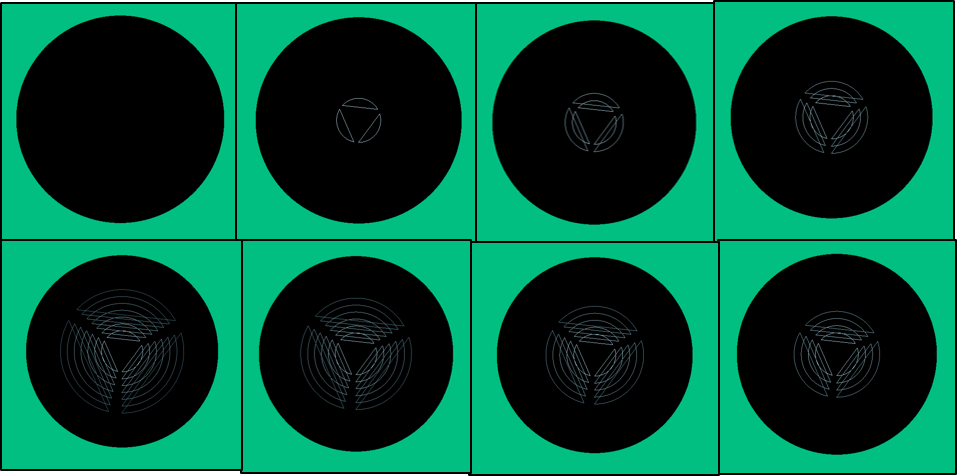
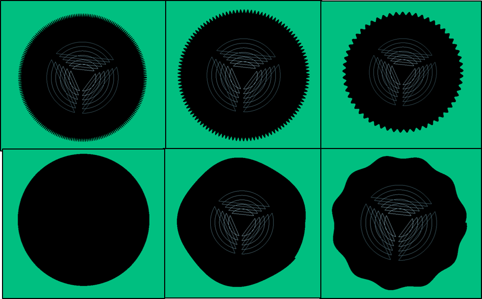
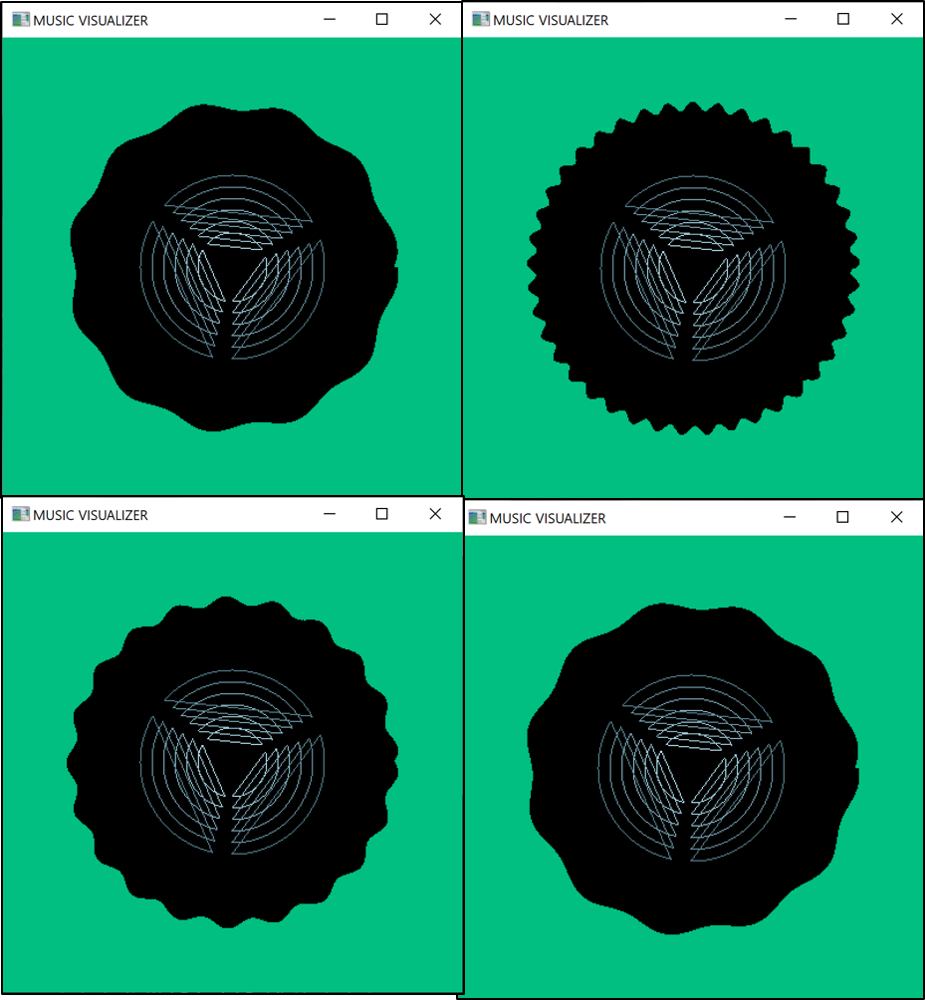

# Music Visualizer
Music Visualizer is a group project made during my 3rd year in BE. It is a **Windows Application** made to **visualize audio** which is currently being played in Windows. We implemented it using **C++ language** where the audio data was retrieved using **Windows API**. The audio data retrieved was then processed to get the instantaneous **Amplitude** and **Frequency** by averaging the data in an instance and **Fast Fourier Transform** was used for getting the frequency. Then the frequency with highest amplitude was taken as pitch for that instance. Then the processed audio data when visualized using **OpenGL** where the Amplitude was displayed using Line Loops of segments and Frequency was displayed using a sine wave on the circumference of the circle.

The changes in Amplitude of audio being played is shown in the below figure (From top left, clockwise):

The changes in Frequency of audio being played is shown in the below figure (From top left, clockwise):

Final Results while playing audio:

